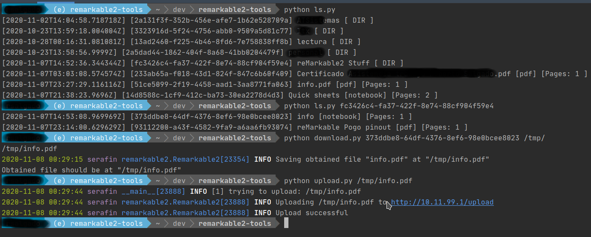
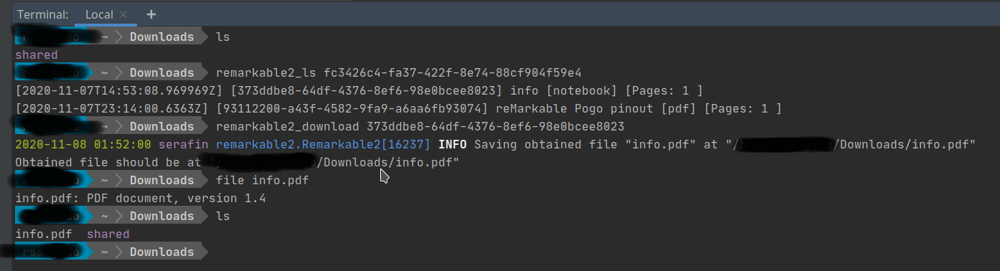
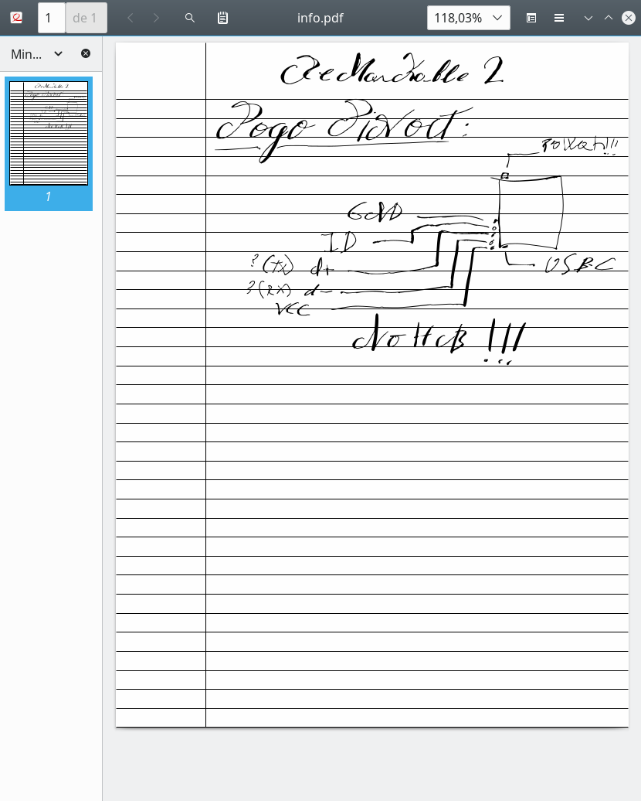

# reMarkable 2 - Python Tools - WebUI
## Description
As **_reMarkable Team_** doesn't provide any **official _GNU/Linux_** tools or software, we are forced to use SSH or, a less aggressive option, USB Web Interface through its USB-C port.

These tools are intend to be simple. Do not expect much from them.
In order to work connect your device via USB-C to your computer and unlock it. Be sure "USB web interface" is enabled, its switch can be found at `Settings » Storage`.

### Version info and commands
Commands: `ls`, `download`, `upload`
_reMarkable2_ version tested: `2.4.1.30`

## Usage Screenshot


## Usage (with aliases):
*More info on how to set them up in [Installation](#create-shell-aliases)*



## Installation
### Create and load python virtual environment (optional)
```bash
python3 -mvenv venv
source venv/bin/activate
pip install -r requirements
```
**Warning**: *if you use this option, you must activate it before using this scripts or call python binary from venv directory* 

### Create shell aliases 
- **if you have created a virtual env, load it first!**
- Open a shell and cd into scripts/this repository main dir; execute next commands  
```bash
cat <<EOF
alias remarkable2_ls="$(which python3) ${PWD}/ls.py"
alias remarkable2_download="$(which python3) ${PWD}/download.py"
alias remarkable2_upload="$(which python3) ${PWD}/upload.py"
alias remarkable2_get="$(which python3) ${PWD}/download.py"
alias remarkable2_put="$(which python3) ${PWD}/upload.py"
EOF
```
- add output lines to your `${HOME}/.bash_aliases` (or check for your favourite shell)
- This should allow you to use these commands from any "current path" like:
```bash
remarkable2_ls 
```


## Commands
### list (ls) script
Script called `ls` will allow listing directories and getting objects UUIDs generated from WebUI
```bash
python ls.py
```
If no UUID is specified it will aim for _root_ directory.

```bash
python ls.py DIRECTORY_UUID
```

### download script
```bash
python download.py UUID # will download reMarkable's reported filename for that UUID into current directory 
python download.py UUID ../ # will download reMarkable's reported filename for that UUID into parent directory
python download.py UUID /tmp/ # will download reMarkable's reported filename for that UUID into /tmp directory
python download.py UUID /tmp/filename.pdf # will download reMarkable's file at /tmp/filename.pdf (don't mess up with extensions)
python download.py UUID new_filename.pdf # will download reMarkable's file at current directory with as filename.pdf
```

Keep in mind if second parameter is in directory expression (ex. /mydir/), it must exist.'
#### Example of downloaded file



### upload script
```bash
python upload.py "file to upload.pdf"
python upload.py "file to upload.pdf" "Second File To Upload"
```

#### To consider on upload:
- These scripts ain't using any argument parser, so be careful.
- USB Web Interface always uploads to root storage, so you gotta move files later but they'll show up immediately.
- Restricted upload to ".pdf" and ".epub" extensions, just to be a little bit careful.
